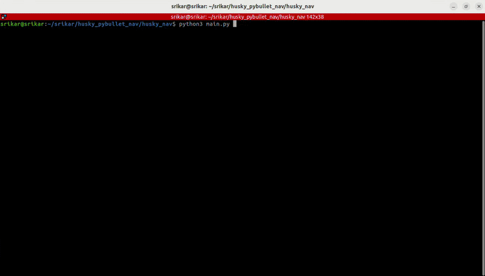

# Husky Autonomous Navigation — PyBullet

Interactive simulation of a Clearpath Husky UGV navigating autonomously
through a static obstacle field.  The user selects start and goal positions
via a click-based GUI; the robot plans and executes a collision-free path
entirely from scratch — no ROS, no navigation stacks.



---

## System Design

```
┌─────────────────────────────────────────────────────────────┐
│                        GUI (PyQt5)                          │
│  WorldCanvas ← user clicks → start / goal positions         │
│  QTimer (50 Hz) drives the main loop                        │
└───────────────┬──────────────────────────┬──────────────────┘
                │                          │
         pose query                  velocity cmd
                │                          │
┌───────────────▼──────────────┐  ┌───────▼────────────────────┐
│  Simulation (PyBullet DIRECT)│  │  Controller (pure pursuit) │
│  • Husky URDF (custom)       │  │  • lookahead point on path │
│  • 4-wheel diff drive        │  │  • κ = 2 sin α / L         │
│  • static box obstacles      │  │  • v, ω → wheel velocities │
└──────────────────────────────┘  └──────────┬─────────────────┘
                                             │ uses
                                  ┌──────────▼──────────────────┐
                                  │  Planner (A*)               │
                                  │  • 2-D occupancy grid       │
                                  │  • obstacle inflation       │
                                  │  • 8-connected A*           │
                                  │  • Gaussian path smoothing  │
                                  └─────────────────────────────┘
```

### Module breakdown

| Module | Path | Responsibility |
|--------|------|----------------|
| **Simulator** | `src/simulator/simulation.py` | PyBullet DIRECT client; Husky URDF loading; obstacle creation; wheel velocity commands; pose queries |
| **URDF generator** | `src/simulator/husky_urdf.py` | Generates a geometrically accurate Husky URDF at runtime (no external assets required) |
| **Planner** | `src/planner/astar.py` | Discretises the world into a grid, inflates obstacles, runs 8-connected A*, smooths the result |
| **Controller** | `src/controller/controller.py` | Pure-pursuit tracking; waypoint advancement; adaptive speed |
| **GUI** | `src/gui/app.py` | PyQt5 window; 2-D bird's-eye canvas; control panel; live metrics |
| **Entry point** | `main.py` | Creates Qt application and shows the main window |

---

## Control Logic

### Differential-drive kinematics

The Husky has four driven wheels (two left, two right).  Given a desired
body-frame linear velocity `v` (m/s) and yaw rate `ω` (rad/s):

```
v_left  = (v − ω · L/2) / R
v_right = (v + ω · L/2) / R
```

where `L = 0.5708 m` (track width) and `R = 0.1651 m` (wheel radius).
These become the `targetVelocity` arguments to PyBullet's
`setJointMotorControl2(..., VELOCITY_CONTROL)`.

### Pure-Pursuit path tracking

1. **Lookahead point** — Walk the path segments from the current base index
   and find the first point that intersects a circle of radius `L_d` centred
   on the robot.  If no intersection exists, use the farthest reachable waypoint.

2. **Heading error** — `α = atan2(Δy, Δx) − yaw`  (wrapped to `[−π, π]`).

3. **Curvature** — `κ = 2 sin(α) / L_d`.

4. **Velocities**:
   - `v = v_max · max(0.2, cos³(α)) · min(1, d_goal / R_slowdown)` so the
     robot stays cautious on sharp turns without stalling in long corridors
   - `ω = v_max · κ · min(1, d_goal / R_slowdown)`  (clamped to `±ω_max`)

The GUI uses tuned controller values (`lookahead_dist=0.4`,
`max_linear_vel=1.0`, `max_angular_vel=3.0`) for reliable convergence through
the default obstacle field while keeping the path visually smooth.

### A\* path planning

- **Grid** — 100 × 100 cells at 0.20 m/cell covering a 20 × 20 m world.
- **Inflation** — obstacles expanded by `robot_radius + safety_margin`
  (0.50 + 0.15 = 0.65 m) before search, guaranteeing clearance.
- **Search** — standard 8-connected A* with Euclidean heuristic.
- **Smoothing** — 5 passes of weighted moving average
  (`0.25 · prev + 0.50 · cur + 0.25 · next`), endpoint-preserving.

---

## Run Instructions

### 1. Open the project root

```bash
cd husky_nav
```

### 2. Create a virtual environment (recommended)

```bash
python3 -m venv .venv
source .venv/bin/activate   # Windows: .venv\Scripts\activate
```

### 3. Install dependencies

```bash
pip install -r requirements.txt
```

### 4. Run

```bash
python main.py
```

### 4a. Headless validation

```bash
python validate_navigation.py
```

This runs an offscreen Qt smoke test and four end-to-end navigation scenarios
without requiring manual GUI interaction.

### 5. How to use

1. Click **📍 Set Start** → click anywhere on the map to place the start marker.
2. Click **🏁 Set Goal**  → click anywhere on the map to place the goal marker.
3. Click **▶ Start** — the planner computes the path and the robot begins
   navigating autonomously.
4. Use **■ Stop** to pause and **↺ Reset** to clear everything.

---

## Bonus features implemented

| Feature | Details |
|---------|---------|
| **Smooth trajectory** | Pure-pursuit + Gaussian-smoothed A* path |
| **Path visualisation** | Dashed cyan path with active waypoint highlight |
| **Robot trail** | Fading green trail shows the robot's history |
| **Live metrics** | Position, heading, velocity, waypoint progress, elapsed time, distance covered |
| **Goal proximity bar** | Progress bar fills as the robot approaches the goal |
| **Adaptive speed** | Robot decelerates near sharp turns and near the goal |

---

## Design Decisions

- **PyBullet DIRECT mode** is used (no OpenGL window) so the physics engine
  runs headlessly inside the Qt process, avoiding cross-thread OpenGL
  conflicts.  All visualisation is in the custom Qt canvas.
- **Custom URDF** is generated at runtime from `husky_urdf.py`; no external
  asset files are needed.
- **QTimer at 50 Hz** drives the loop; 5 physics sub-steps per tick keep the
  simulation close to real time at 1/240 s timestep.
- **Modular layout** — each subsystem is an independent class with a clean
  interface; `main.py` and `app.py` are the only files that wire them together.

---

## Project Structure

```
husky_pybullet_nav/
├── main.py
├── requirements.txt
├── README.md
└── src/
    ├── simulator/
    │   ├── simulation.py       ← PyBullet wrapper
    │   └── husky_urdf.py       ← URDF generator
    ├── controller/
    │   └── controller.py       ← Pure-pursuit controller
    ├── planner/
    │   └── astar.py            ← A* path planner
    └── gui/
        └── app.py              ← PyQt5 GUI + main window
```
